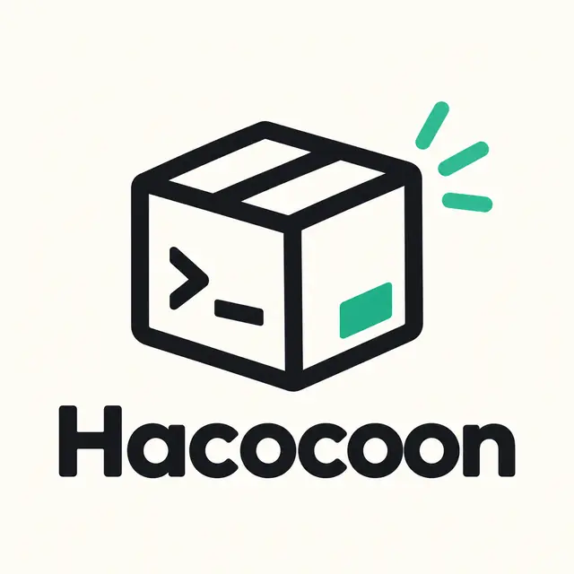
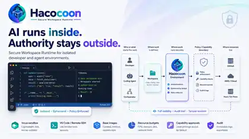

<div align="center">



# Hacocoon

**読み方: はこーん**

### AI は中で自由に。Host の権限は外で守る。

**人間・開発ツール・Coding Agent向けのOSS Secure Workspace Runtime。**

[English](README.md) · [ドキュメント](docs/README.ja.md) · [セキュリティ](docs/security/security-architecture.md) · [実装状況](docs/IMPLEMENTATION_STATUS.ja.md) · [ロードマップ](docs/status/architecture-and-roadmap.md)

[](https://github.com/SLktEx/Hacocoon/actions/workflows/test.yml)
[](LICENSE)

</div>

<p align="center"></p>

HacocoonはWorkspaceを隔離された実行境界の中に置き、特権authorityをtrusted Host側に残します。Coding AgentはEnvironment内でpackage install、source edit、build、test、debug、破壊的変更まで自由に行えますが、それだけを理由にHost credential、Incus管理authority、無制限の外部アクセス、自分自身のresource limitを引き上げる権限までは得ません。

> [!WARNING]
> **Hacocoonはまだpre-1.0で、Breaking Changeは今後も発生します。**
>
> product-facingな`haco` CLIは現在、基本のuser workflowから作り直しています。これまでのCLIはmigration専用の一時名`hacoq`として残しますが、最終的には削除します。[CLI migration](docs/CLI_MIGRATION.md) を参照してください。
>
> 現在のEnvironment backendはIncusです。Provider seamはgenericなまま維持し、以前のconcrete EC2/AWS/EBS implementationはdeferredです。現在のrepository realityとreal-host acceptance gapは [実装状況](docs/IMPLEMENTATION_STATUS.ja.md)、authoritativeなfast-moving development checkpointは [Versioning / Release status](docs/status/versioning-and-release-status.ja.md) を参照してください。

## なぜHacocoon?

```text
VS Code / Shell / Coding Agent / Orchestrator
                     |
                  Workspace
                     |
          +----------v------------+
          |       Hacocoon        |
          | isolated Environment  |
          | resource budgets      |
          | workspace leases      |
          | policy / approvals    |
          | capabilities / audit  |
          +----------+------------+
                     |
            Environment provider
                     |
              Incus (current)
```

Hacocoonは **Environment内での自由** と **Host / external serviceを触るauthority** を分離します。

## Quick start

<p align="center"></p>

```bash
git clone https://github.com/SLktEx/Hacocoon.git
cd Hacocoon

go build -o ./bin/haco ./cmd/haco-product
go build -o ./bin/hacoq ./cmd/haco
go build -o ./bin/haco-vscode ./cmd/haco-vscode
go build -o ./bin/haco-agent-host ./cmd/haco-agent-host
go build -o ./bin/haco-notify ./cmd/haco-notify

./bin/haco --version
./bin/haco help
```

新しい`haco`は意図的に小さく始めます。既存のlow-level機能は移行期間だけ`hacoq`から利用できますが、新しいintegrationを`hacoq`へ依存させないでください。

移行中の既存Workspace操作例:

```bash
./bin/hacoq run --workspace "$PWD" -- go test ./...
./bin/hacoq create --workspace "$PWD" dev
./bin/hacoq exec dev -- go test ./...
./bin/hacoq shell dev
./bin/hacoq status dev
./bin/hacoq delete dev
```

VS Codeでは:

```bash
./bin/haco-vscode open .
```

VS Codeは最初のconvenience clientであり、Core dependencyではありません。Windows + WSL hostの準備は [Windows / WSL bootstrap](docs/WINDOWS_WSL_BOOTSTRAP.ja.md) を参照してください。supported local pathでは通常のinteractive WSL entryがpersistent trusted `haco-host` を開き、Physical Host rootは明示recovery pathとして残ります。

## Core / Standard / Plugin

| Layer | 役割 | 例 |
|---|---|---|
| **Core** | 安定したproduct semantics / security boundary | Environment、Workspace lease、Policy、Capability、interaction contract |
| **Standard** | 通常配布で使うproject-maintainedな交換可能default | 現在のIncus backend、hostname-aware egress enforcement |
| **Plugin** | optional / specialized integration | Git helper、nerdctl / Docker / OCI tooling |

詳細は [Adapter and extension architecture](docs/design/plugin-architecture.md) と [設計原則](docs/DESIGN_PRINCIPLES.ja.md) を参照してください。

## Baseとoptional OCI tooling

CLI migration中、既存のlow-level operationは一時的に`hacoq`から利用します。

```bash
hacoq base list
hacoq base inspect haco/ubuntu-26.04
hacoq create --base haco/ubuntu-26.04 --workspace "$PWD" dev

HACO_PLUGIN_OCI=nerdctl hacoq plugin oci seed sample
HACO_PLUGIN_OCI=nerdctl hacoq plugin oci seed recommend
HACO_PLUGIN_OCI=nerdctl hacoq plugin oci seed build
HACO_PLUGIN_OCI=nerdctl hacoq plugin oci seed current
HACO_PLUGIN_OCI=docker  hacoq plugin oci docker status dev
HACO_PLUGIN_OCI=docker  hacoq plugin oci docker prepare dev
```

Coreはcontainerd、nerdctl、Docker、local Registryを必須にしません。現在の実装realityは [実装状況](docs/IMPLEMENTATION_STATUS.ja.md)、意図的に速く進めるpre-1.0 checkpoint番号と履歴は [Versioning / Release status](docs/status/versioning-and-release-status.ja.md) を正本とします。READMEにはcheckpoint tableを複製しません。Local OCI Registryはdeferred/unversionedなoptional infrastructureです。

## Reusable client

`pkg/clientadapter` はexact Environment ensure/reuse、status、`/workspace` discovery、loopback SSH/TCP connection、revoke/delete、interaction batchのclient-neutral contractを提供します。SSH private keyとIDE configはclient自身が保持し、Hacocoonが受け取るのはpublic-key materialだけです。

notification clientは同じread-only interaction streamをbrowser、native OS、optional VS Code notificationへ接続しますが、event観測をapproval pathにはしません。

詳細は [Reusable client adapter contract](docs/CLIENT_ADAPTER_CONTRACT.ja.md) と [Interaction events](docs/INTERACTION_EVENTS.ja.md) を参照してください。

## Security model

Trusted HostがHacocoon state、Policy、Credential、Resource ceiling、privileged Capability executionを所有します。Coding AgentがEnvironment内でcode edit / build / test / debugをするためだけに、HacocoonやIncusのmanagement authorityは必要ありません。local Incus pathのpersistent `haco-host` はTCBの一部で、untrusted Environmentとは分離し、raw Incus controlはPhysical Host側に残します。

Security-sensitiveな変更の前に [Security architecture](docs/security/security-architecture.md)、[Trusted logical Host](docs/design/trusted-host.ja.md)、[adversarial audit guide](.github/security/ADVERSARIAL_AUDIT.md) を読んでください。

## ドキュメント

- [ドキュメント一覧](docs/README.ja.md)
- [CLI migration](docs/CLI_MIGRATION.md)
- [Documentation style guide](docs/DOCUMENTATION_STYLE_GUIDE.md)
- [実装状況](docs/IMPLEMENTATION_STATUS.ja.md)
- [Architecture / Roadmap](docs/status/architecture-and-roadmap.md)
- [Versioning / Release status](docs/status/versioning-and-release-status.ja.md)
- [Trusted logical Host](docs/design/trusted-host.ja.md)
- [用語と境界](docs/reference/terminology-and-boundaries.md)

通常のdocumentation pathはsemantic nameを使い、feature addressへrelease/milestone番号を含めません。ADR sequence numberだけはidentityとして例外です。

## 開発

Hacocoonのprimary supported Host baselineは **Ubuntu 26.04+** です。GitHub-hosted Linux CIも **`ubuntu-26.04`** に明示固定し、`ubuntu-latest` や古いUbuntu世代ではなく同じbaselineを直接検証します。real Incus、managed-storage privilege、trusted-host acceptanceの詳細はintroへ複製せず、implementation/statusの正本で追跡します。

```bash
go test ./...
go test -race ./...
go vet ./...
python tools/check_docs.py
bash tools/ci-local.sh
```

## License

Hacocoonは [Apache License 2.0](LICENSE) で公開します。
